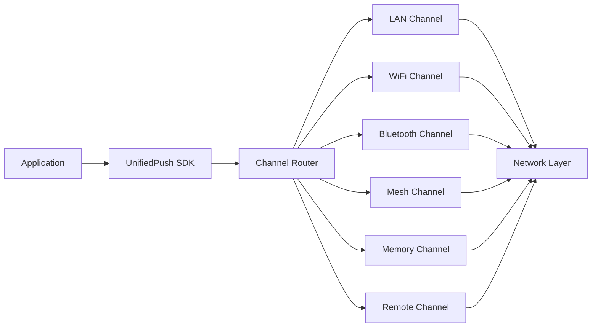
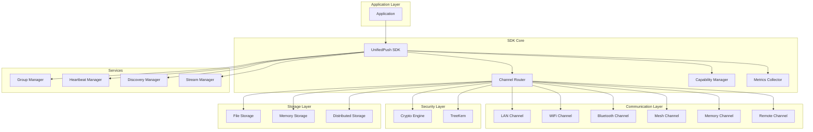
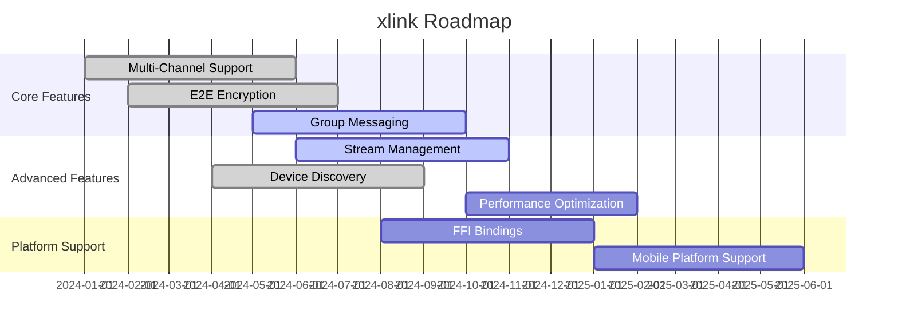

<div align="center">

# 🚀 xlink

<p>
  <!-- 版本 -->
  
  <!-- 许可证 -->
  
  <!-- Rust 版本 -->
  
  <!-- CI 状态 -->
  <a href="#"></a>
</p>

<p align="center">
  <strong>Unified Multi-Channel Push SDK with End-to-End Encryption</strong>
</p>

<p align="center">
  <a href="#-features">Features</a> •
  <a href="#-quick-start">Quick Start</a> •
  <a href="#-documentation">Documentation</a> •
  <a href="#-examples">Examples</a> •
  <a href="#-contributing">Contributing</a>
</p>

</div>

---

## 📋 Table of Contents

<details open>
<summary>Click to expand</summary>

- [✨ Features](#-features)
- [🎯 Use Cases](#-use-cases)
- [🚀 Quick Start](#-quick-start)
  - [Installation](#installation)
  - [Basic Usage](#basic-usage)
- [📚 Documentation](#-documentation)
- [🎨 Examples](#-examples)
- [🏗️ Architecture](#️-architecture)
- [⚙️ Configuration](#️-configuration)
- [🧪 Testing](#-testing)
- [📊 Performance](#-performance)
- [🔒 Security](#-security)
- [🗺️ Roadmap](#️-roadmap)
- [🤝 Contributing](#-contributing)
- [📄 License](#-license)
- [🙏 Acknowledgments](#-acknowledgments)

</details>

---

## ✨ Features

<table>
<tr>
<td width="50%">

### 🎯 Core Features

- ✅ **Multi-Channel Communication** - Supports LAN, WiFi, Bluetooth, Mesh, Memory, and Remote channels
- ✅ **End-to-End Encryption** - X25519 key exchange with ChaCha20Poly1305 encryption
- ✅ **Group Messaging** - Secure group chat with broadcast capabilities and TreeKem support
- ✅ **Stream Management** - Handle large file transmission with automatic chunking and reassembly

</td>
<td width="50%">

### ⚡ Advanced Features

- 🚀 **Smart Channel Routing** - Intelligent channel selection based on device capabilities and network conditions
- 🔐 **DoS Protection** - Built-in rate limiting and abuse prevention
- 📊 **Metrics Collection** - Real-time performance monitoring and diagnostics
- 🔧 **Device Discovery** - mDNS and BLE-based background device discovery

</td>
</tr>
</table>

<table>
<tr>
<td width="50%">

### 💡 Communication Features

- **Heartbeat Mechanism** - Maintain connection health with periodic heartbeat messages
- **Capability Detection** - Automatic discovery of remote device capabilities
- **Stream Handling** - Automatic chunking and reassembly for large messages (>32KB)
- **Priority Messaging** - Support for high-priority message delivery

</td>
<td width="50%">

### 🛡️ Security Features

- **X25519 Key Exchange** - Secure key agreement protocol
- **ChaCha20Poly1305** - Authenticated encryption for all messages
- **Ed25519 Signatures** - Message signing and verification
- **HMAC/HKDF** - Key derivation and message authentication
- **Device Migration** - Export and import SDK state for device transfer

</td>
</tr>
</table>

<div align="center">

### 🔄 Channel Architecture

</div>



---

## 🎯 Use Cases

<details>
<summary><b>💼 Local Network Messaging</b></summary>

<br>

Perfect for office, home, or industrial environments where devices communicate over local networks without internet dependency.

```rust
use std::sync::Arc;
use xlink::channels::lan::LanChannel;
use xlink::xLink;

let lan_channel: Arc<dyn xlink::core::traits::Channel> = Arc::new(LanChannel::new());
let sdk = xLink::new(capabilities, vec![lan_channel]).await?;
sdk.start().await?;
```

</details>

<details>
<summary><b>📱 Mesh Network Communication</b></summary>

<br>

Ideal for ad-hoc networks, IoT deployments, and scenarios where devices form peer-to-peer mesh networks.

```rust
use std::sync::Arc;
use xlink::channels::mesh::MeshChannel;

let mesh_channel: Arc<dyn xlink::core::traits::Channel> = Arc::new(MeshChannel::new());
let sdk = xLink::new(capabilities, vec![mesh_channel]).await?;
```

</details>

<details>
<summary><b>🔒 Secure Group Chat</b></summary>

<br>

Enterprise-grade encrypted group messaging with TreeKem forward secrecy and efficient broadcast.

```rust
use xlink::core::types::{DeviceId, MessagePayload};

let group_manager = sdk.group_manager();
group_manager.create_group(vec![alice_id, bob_id]).await?;
group_manager.broadcast_message(group_id, payload).await?;
```

</details>

<details>
<summary><b>📹 Large File Transfer</b></summary>

<br>

Automatic stream handling for large files and video streams with chunking and reassembly.

```rust
use xlink::core::types::MessagePayload;

let large_data = std::fs::read("large_file.mp4")?;
sdk.send(recipient, MessagePayload::Binary(large_data)).await?;
// Automatically uses stream transmission for data > 32KB
```

</details>

---

## 🚀 Quick Start

### Installation

<table>
<tr>
<td width="50%">

#### 🦀 Rust

```toml
[dependencies]
xlink = "0.1"
```

</td>
<td width="50%">

#### 📋 Required Features

```toml
[dependencies]
xlink = { version = "0.1", features = ["full"] }
```

</td>
</tr>
</table>

### Basic Usage

<div align="center">

#### 🎬 5-Minute Quick Start

</div>

<table>
<tr>
<td width="50%">

**Step 1: Define Device Capabilities**

```rust
use xlink::core::types::{
    ChannelType, DeviceCapabilities, DeviceId, DeviceType,
};
use std::collections::HashSet;

let device_id = DeviceId::new();
let capabilities = DeviceCapabilities {
    device_id,
    device_type: DeviceType::Smartphone,
    device_name: "My Phone".to_string(),
    supported_channels: HashSet::from([
        ChannelType::Lan,
        ChannelType::BluetoothLE,
    ]),
    battery_level: Some(80),
    is_charging: false,
    data_cost_sensitive: false,
};
```

</td>
<td width="50%">

**Step 2: Create SDK Instance**

```rust
use xlink::xLink;
use xlink::channels::memory::MemoryChannel;

let channel = Arc::new(MemoryChannel::new(handler, 50));
let sdk = xLink::new(capabilities, vec![channel]).await?;
sdk.start().await?;
```

</td>
</tr>
</table>

<details>
<summary><b>📖 Complete Example</b></summary>

<br>

```rust
use std::collections::HashSet;
use std::sync::Arc;
use xlink::channels::memory::MemoryChannel;
use xlink::core::types::{
    ChannelType, DeviceCapabilities, DeviceId, DeviceType, MessagePayload,
};
use xlink::xLink;

#[tokio::main]
async fn main() -> Result<(), Box<dyn std::error::Error>> {
    let alice_id = DeviceId::new();
    let alice_caps = DeviceCapabilities {
        device_id: alice_id,
        device_type: DeviceType::Smartphone,
        device_name: "Alice Phone".to_string(),
        supported_channels: HashSet::from([ChannelType::Lan]),
        battery_level: Some(80),
        is_charging: false,
        data_cost_sensitive: false,
    };

    let channel = Arc::new(MemoryChannel::new(handler, 50));
    let sdk = xLink::new(alice_caps, vec![channel]).await?;
    sdk.start().await?;

    // Send a message
    let bob_id = DeviceId::new();
    sdk.send(bob_id, MessagePayload::Text("Hello!".to_string())).await?;

    sdk.stop().await;
    Ok(())
}
```

</details>

---

## 📚 Documentation

<div align="center">

<table>
<tr>
<td align="center" width="25%">
<a href="docs/USER_GUIDE.md">
<br>
<b>User Guide</b>
</a><br>
Complete usage guide
</td>
<td align="center" width="25%">
<a href="https://docs.rs/xlink">
<br>
<b>API Reference</b>
</a><br>
Full API documentation
</td>
<td align="center" width="25%">
<a href="docs/ARCHITECTURE.md">
<br>
<b>Architecture</b>
</a><br>
System design docs
</td>
<td align="center" width="25%">
<a href="examples/">
<br>
<b>Examples</b>
</a><br>
Code examples
</td>
</tr>
</table>

</div>

### 📖 Additional Resources

- 🎓 [Tutorials](docs/TUTORIALS.md) - Step-by-step learning
- 🔧 [Advanced Topics](docs/ADVANCED.md) - Deep dive guides
- ❓ [FAQ](docs/FAQ.md) - Frequently asked questions
- 🐛 [Troubleshooting](docs/TROUBLESHOOTING.md) - Common issues

---

## 🎨 Examples

<div align="center">

### 💡 Real-world Examples

</div>

<table>
<tr>
<td width="50%">

#### 📝 Example 1: Simple Chat

Basic point-to-point messaging between two devices.

**File**: [examples/simple_chat.rs](examples/simple_chat.rs)

```rust
use xlink::channels::memory::MemoryChannel;
use xlink::core::types::{ChannelType, DeviceCapabilities, MessagePayload};
use xlink::xLink;

let sdk = xLink::new(capabilities, vec![channel]).await?;
sdk.start().await?;
sdk.send(recipient, MessagePayload::Text("Hello".to_string())).await?;
```

</td>
<td width="50%">

#### 👥 Example 2: Group Chat

Secure group messaging with multiple participants.

**File**: [examples/group_chat.rs](examples/group_chat.rs)

```rust
use xlink::group::manager::GroupManager;

let group_manager = sdk.group_manager();
let group_id = group_manager.create_group(members).await?;
group_manager.broadcast_message(group_id, payload).await?;
```

</td>
</tr>
</table>

<table>
<tr>
<td width="50%">

#### 🔄 Example 3: Channel Switching

Dynamic channel management and switching.

**File**: [examples/channel_switching.rs](examples/channel_switching.rs)

```rust
use xlink::channels::wifi::WifiChannel;
use xlink::channels::bluetooth::BluetoothChannel;

let wifi = Arc::new(WifiChannel::new());
let bluetooth = Arc::new(BluetoothChannel::new());
let sdk = xLink::new(capabilities, vec![wifi, bluetooth]).await?;
```

</td>
<td width="50%">

#### 📡 Example 4: Background Discovery

Device discovery in background mode.

**File**: [examples/background_discovery.rs](examples/background_discovery.rs)

```rust
sdk.start().await?;
// Discovery runs automatically in background
// mDNS and BLE discovery are enabled by default
```

</td>
</tr>
</table>

<table>
<tr>
<td width="50%">

#### 📱 Example 5: Device Migration

Export and import SDK state for device transfer.

**File**: [examples/device_migration.rs](examples/device_migration.rs)

```rust
let state = sdk.export_sdk_state()?;
std::fs::write("backup.dat", &state)?;

// On new device
let data = std::fs::read("backup.dat")?;
sdk.import_sdk_state(&data)?;
```

</td>
<td width="50%">

**[📂 View All Examples →](examples/)**

</td>
</tr>
</table>

---

## 🏗️ Architecture

<div align="center">

### System Overview

</div>



<details>
<summary><b>📐 Component Details</b></summary>

<br>

| Component | Description | Status |
|-----------|-------------|--------|
| **UnifiedPush SDK** | Main SDK entry point managing all components | ✅ Stable |
| **Channel Router** | Intelligent routing based on capabilities and network | ✅ Stable |
| **Capability Manager** | Device and channel capability detection and management | ✅ Stable |
| **Crypto Engine** | X25519 key exchange, ChaCha20Poly1305 encryption | ✅ Stable |
| **TreeKem** | Group key management with forward secrecy | ✅ Stable |
| **Group Manager** | Group creation, membership, and broadcast | ✅ Stable |
| **Heartbeat Manager** | Connection health monitoring | ✅ Stable |
| **Discovery Manager** | mDNS and BLE device discovery | ✅ Stable |
| **Stream Manager** | Large file chunking and reassembly | ✅ Stable |
| **Metrics Collector** | Performance monitoring and diagnostics | ✅ Stable |

</details>

---

## ⚙️ Configuration

<div align="center">

### 🎛️ Configuration Options

</div>

### Device Capabilities Configuration

```rust
use xlink::core::types::{ChannelType, DeviceCapabilities, DeviceType};

let capabilities = DeviceCapabilities {
    device_id: DeviceId::new(),
    device_type: DeviceType::Smartphone,
    device_name: "My Device".to_string(),
    supported_channels: HashSet::from([
        ChannelType::Lan,
        ChannelType::BluetoothLE,
        ChannelType::WiFiDirect,
    ]),
    battery_level: Some(100),
    is_charging: true,
    data_cost_sensitive: false,
};
```

### Channel Configuration

| Channel Type | Description | Use Case |
|--------------|-------------|----------|
| `Lan` | Local Area Network communication | Office, home networks |
| `WiFiDirect` | WiFi direct communication | Wireless direct connection |
| `BluetoothLE` | Bluetooth Low Energy | Short-range, low power |
| `BluetoothMesh` | Bluetooth Mesh networking | Multi-hop mesh, IoT |
| `Internet` | Cloud/Internet communication | Remote messaging |
| `Memory` | In-memory channel (testing) | Testing, IPC |

<details>
<summary><b>🔧 All Configuration Options</b></summary>

<br>

| Option | Type | Default | Description |
|--------|------|---------|-------------|
| `device_id` | UUID | Auto-generated | Unique device identifier |
| `device_type` | Enum | Required | Device type (Smartphone, Laptop, etc.) |
| `device_name` | String | Required | Human-readable device name |
| `supported_channels` | Set | Required | Set of supported channel types |
| `battery_level` | Option<u8> | None | Current battery percentage |
| `is_charging` | bool | false | Whether device is charging |
| `data_cost_sensitive` | bool | false | Optimize for data usage |

### Compliance Configuration

```rust
use xlink::core::types::ComplianceConfig;

let compliance = ComplianceConfig {
    retention_days: 30,  // Keep data for 30 days
    auto_cleanup: true,  // Enable automatic cleanup
};
```

</details>

---

## 🧪 Testing

<div align="center">

### 🎯 Test Coverage

</div>

```bash
# Run all tests
cargo test --all-features

# Run specific test categories
cargo test --test unit_core          # Unit tests
cargo test --test integration_system # Integration tests
cargo test --test integration_group  # Group messaging tests
cargo test --test integration_channels # Channel tests

# Run with coverage
cargo tarpaulin --out Html

# Run benchmarks
cargo bench

# Run specific test
cargo test test_name
```

<details>
<summary><b>📊 Test Categories</b></summary>

<br>

| Category | Description | Files |
|----------|-------------|-------|
| Unit Tests | Core functionality tests | `tests/unit_core.rs` |
| Integration Tests | System integration tests | `tests/integration_*.rs` |
| Performance Tests | Benchmark tests | `benches/performance.rs` |
| DoS Protection | Security tests | `tests/dos_protection_tests.rs` |
| Memory Tests | Memory management tests | `tests/test_memory_*.rs` |
| Large File Tests | Stream handling tests | `tests/large_file_transmission_tests.rs` |

</details>

---

## 📊 Performance

<div align="center">

### ⚡ Benchmark Results

</div>

<table>
<tr>
<td width="50%">

**Message Processing**

```
Small messages (<1KB): ~10,000 ops/sec
Medium messages (1-32KB): ~5,000 ops/sec
Large messages (>32KB): ~1,000 ops/sec (streamed)
```

</td>
<td width="50%">

**Latency (Memory Channel)**

```
P50: 0.5ms
P95: 1.2ms
P99: 2.5ms
```

</td>
</tr>
</table>

<details>
<summary><b>📈 Detailed Benchmarks</b></summary>

<br>

```bash
# Run benchmarks
cargo bench

# Available benchmarks:
# - bench_message_send: Message sending performance
# - bench_channel_router: Routing decision performance
# - bench_encryption: Encryption/decryption performance
# - bench_group_broadcast: Group broadcast performance
```

</details>

---

## 🔒 Security

<div align="center">

### 🛡️ Security Features

</div>

<table>
<tr>
<td align="center" width="25%">
<br>
<b>End-to-End Encryption</b><br>
X25519 + ChaCha20Poly1305
</td>
<td align="center" width="25%">
<br>
<b>Group Forward Secrecy</b><br>
TreeKem key rotation
</td>
<td align="center" width="25%">
<br>
<b>DoS Protection</b><br>
Rate limiting (100 msg/sec)
</td>
<td align="center" width="25%">
<br>
<b>Message Signing</b><br>
Ed25519 signatures
</td>
</tr>
</table>

<details>
<summary><b>🔐 Security Details</b></summary>

<br>

### Cryptographic Primitives

| Operation | Algorithm | Purpose |
|-----------|-----------|---------|
| Key Exchange | X25519 | Secure key agreement |
| Encryption | ChaCha20Poly1305 | Authenticated encryption |
| Signatures | Ed25519 | Message authentication |
| Key Derivation | HKDF-SHA256 | Key material derivation |
| Hashing | SHA-256 | Integrity verification |

### Security Measures

- ✅ **Rate Limiting** - 100 messages/second per device
- ✅ **Memory Safety** - Zero-copy operations where possible
- ✅ **Session Management** - Automatic session cleanup on drop
- ✅ **Device Migration** - Encrypted state export/import

### Reporting Security Issues

Please report security vulnerabilities to: security@example.com

</details>

---

## 🗺️ Roadmap

<div align="center">

### 🎯 Development Timeline

</div>



<table>
<tr>
<td width="50%">

### ✅ Completed

- [x] Core SDK architecture
- [x] Multi-channel support (LAN, WiFi, Bluetooth, Mesh, Memory, Remote)
- [x] End-to-end encryption (X25519, ChaCha20Poly1305)
- [x] Device discovery (mDNS, BLE)
- [x] Heartbeat mechanism
- [x] DoS protection
- [x] Metrics collection
- [x] Unit and integration tests

</td>
<td width="50%">

### 🚧 In Progress

- [ ] TreeKem group key management
- [ ] Stream optimization for large files
- [ ] Performance benchmarks
- [ ] FFI bindings for other languages
- [ ] Platform-specific optimizations

</td>
</tr>
<tr>
<td width="50%">

### 📋 Planned

- [ ] Mobile SDK (iOS, Android)
- [ ] Cloud relay service
- [ ] Admin dashboard
- [ ] Enterprise features
- [ ] Plugin system

</td>
<td width="50%">

### 💡 Future Ideas

- [ ] Quantum-resistant encryption
- [] AI-powered channel selection
- [ ] Edge computing integration
- [ ] Blockchain-based identity
- [ ] Decentralized messaging

</td>
</tr>
</table>

---

## 🤝 Contributing

<div align="center">

### 💖 We Love Contributors!

</div>

<table>
<tr>
<td width="33%" align="center">

### 🐛 Report Bugs

Found a bug?<br>
[Create an Issue](../../issues)

</td>
<td width="33%" align="center">

### 💡 Request Features

Have an idea?<br>
[Start a Discussion](../../discussions)

</td>
<td width="33%" align="center">

### 🔧 Submit PRs

Want to contribute?<br>
[Fork & PR](../../pulls)

</td>
</tr>
</table>

<details>
<summary><b>📝 Contribution Guidelines</b></summary>

<br>

### How to Contribute

1. **Fork** the repository
2. **Clone** your fork: `git clone https://github.com/yourusername/xlink.git`
3. **Create** a branch: `git checkout -b feature/amazing-feature`
4. **Make** your changes
5. **Test** your changes: `cargo test --all-features`
6. **Commit** your changes: `git commit -m 'Add amazing feature'`
7. **Push** to branch: `git push origin feature/amazing-feature`
8. **Create** a Pull Request

### Code Style

- Follow Rust standard coding conventions (`cargo fmt`)
- Write comprehensive tests for new features
- Update documentation for API changes
- Add examples for new features
- Ensure all tests pass before submitting

</details>

---

## 📄 License

<div align="center">

This project is licensed under the MIT License.

[](LICENSE)

</div>

---

## 🙏 Acknowledgments

<div align="center">

### Built With Amazing Tools

</div>

<table>
<tr>
<td align="center" width="25%">
<a href="https://www.rust-lang.org/">
<br>
<b>Rust</b>
</a>
</td>
<td align="center" width="25%">
<a href="https://tokio.rs/">
<br>
<b>Tokio</b>
</a>
</td>
<td align="center" width="25%">
<a href="https://github.com/">
<br>
<b>GitHub</b>
</a>
</td>
<td align="center" width="25%">
<a href="https://crates.io/">
<br>
<b>Crates.io</b>
</a>
</td>
</tr>
</table>

### Special Thanks

- 🌟 **Dependencies** - Built on these amazing projects:
  - [tokio](https://github.com/tokio-rs/tokio) - Async runtime
  - [dashmap](https://github.com/xacrimon/dashmap) - Concurrent HashMap
  - [x25519-dalek](https://github.com/dalek-cryptography/x25519-dalek) - X25519 key exchange
  - [chacha20poly1305](https://github.com/RustCrypto/AEADs) - Authenticated encryption
  - [serde](https://github.com/serde-rs/serde) - Serialization framework

- 👥 **Contributors** - Thanks to all our amazing contributors!
- 💬 **Community** - Special thanks to our community members

---

## 📞 Contact & Support

<div align="center">

<table>
<tr>
<td align="center" width="33%">
<a href="../../issues">
<br>
<b>Issues</b>
</a><br>
Report bugs & issues
</td>
<td align="center" width="33%">
<a href="../../discussions">
<br>
<b>Discussions</b>
</a><br>
Ask questions & share ideas
</td>
<td align="center" width="33%">
<a href="https://github.com/xlink/xlink">
<br>
<b>GitHub</b>
</a><br>
View source code
</td>
</tr>
</table>

### Stay Connected

[](mailto:contact@example.com)

</div>

---

<div align="center">

### 💝 Support This Project

If you find this project useful, please consider giving it a ⭐️!

**Built with ❤️ by Kirky.X <Kirky-X@outlook.com>**

[⬆ Back to Top](#-xlink)

---

<sub>© 2024 xlink. All rights reserved.</sub>

</div>
