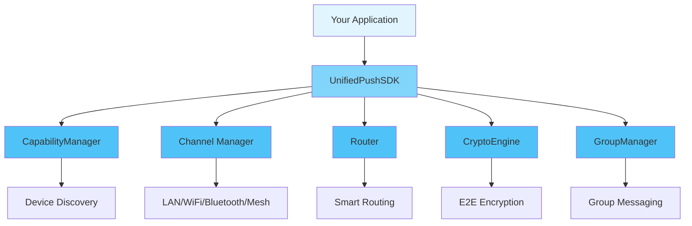

<div align="center">

# 📖 User Guide

### Complete Guide to Using XPush

[🏠 Home](../README.md) • [📚 Docs](README.md) • [🎯 Examples](../examples/) • [❓ FAQ](FAQ.md)

---

</div>

## 📋 Table of Contents

- [Introduction](#introduction)
- [Getting Started](#getting-started)
  - [Prerequisites](#prerequisites)
  - [Installation](#installation)
  - [First Steps](#first-steps)
- [Core Concepts](#core-concepts)
- [Basic Usage](#basic-usage)
  - [Initialization](#initialization)
  - [Configuration](#configuration)
  - [Basic Operations](#basic-operations)
- [Advanced Usage](#advanced-usage)
  - [Custom Configuration](#custom-configuration)
  - [Performance Tuning](#performance-tuning)
  - [Error Handling](#error-handling)
- [Best Practices](#best-practices)
- [Common Patterns](#common-patterns)
- [Troubleshooting](#troubleshooting)
- [Next Steps](#next-steps)

---

## Introduction

<div align="center">

### 🎯 What You'll Learn

</div>

<table>
<tr>
<td width="25%" align="center">
<br>
<b>Quick Start</b><br>
Get up and running in 5 minutes
</td>
<td width="25%" align="center">
<br>
<b>Configuration</b><br>
Customize to your needs
</td>
<td width="25%" align="center">
<br>
<b>Best Practices</b><br>
Learn the right way
</td>
<td width="25%" align="center">
<br>
<b>Advanced Topics</b><br>
Master the details
</td>
</tr>
</table>

**XPush** is a unified cross-platform communication SDK that supports multiple communication channels including LAN, WiFi, Bluetooth, Mesh, Memory, and Remote. This guide will walk you through everything from basic setup to advanced usage patterns.

> 💡 **Tip**: This guide assumes basic knowledge of Rust and async programming. If you're new to Rust, check out the [Rust Book](https://doc.rust-lang.org/book/) first.

---

## Getting Started

### Prerequisites

Before you begin, ensure you have the following installed:

<table>
<tr>
<td width="50%">

**Required**
- ✅ Rust 1.75+ (stable)
- ✅ Cargo (comes with Rust)
- ✅ Git

</td>
<td width="50%">

**Optional**
- 🔧 IDE with Rust support
- 🔧 Docker (for containerized deployment)
- 🔧 [Additional tool]

</td>
</tr>
</table>

<details>
<summary><b>🔍 Verify Your Installation</b></summary>

```bash
# Check Rust version
rustc --version
# Expected: rustc 1.75.0 (or higher)

# Check Cargo version
cargo --version
# Expected: cargo 1.75.0 (or higher)

# Check Git version
git --version
# Expected: git version 2.x.x
```

</details>

### Installation

<div align="center">

#### Choose Your Installation Method

</div>

<table>
<tr>
<td width="50%">

**📦 Using Cargo (Recommended)**

```bash
# Add to Cargo.toml
[dependencies]
xpush = "0.1"

# Or install via command
cargo add xpush
```

</td>
<td width="50%">

**🐙 From Source**

```bash
git clone https://github.com/xpush/xpush
cd xpush
cargo build --release
```

</td>
</tr>
</table>

<details>
<summary><b>🌐 Adding as Rust Dependency</b></summary>

**Using Cargo**
```bash
cargo add xpush
```

**Using Cargo Edit**
```bash
cargo edit add xpush
```

</details>

### First Steps

Let's verify your installation with a simple example:

```rust
use xpush::UnifiedPushSDK;
use xpush::core::types::DeviceCapabilities;
use xpush::core::types::DeviceId;
use std::collections::HashSet;
use xpush::core::types::ChannelType;

#[tokio::main]
async fn main() -> Result<(), Box<dyn std::error::Error>> {
    let device_id = DeviceId::new();
    let capabilities = DeviceCapabilities {
        device_id,
        device_type: xpush::core::types::DeviceType::Smartphone,
        device_name: "My Device".to_string(),
        supported_channels: HashSet::from([ChannelType::Lan]),
        battery_level: Some(80),
        is_charging: false,
        data_cost_sensitive: false,
    };

    let sdk = UnifiedPushSDK::new(capabilities, vec![]).await?;
    sdk.start().await?;

    println!("✅ XPush SDK is ready!");

    Ok(())
}
```

<details>
<summary><b>🎬 Run the Example</b></summary>

```bash
# Create a new project
cargo new hello-xpush
cd hello-xpush

# Add dependency
cargo add xpush

# Copy the code above to src/main.rs

# Run it!
cargo run
```

**Expected Output:**
```
✅ XPush SDK is ready!
```

</details>

---

## Core Concepts

Understanding these core concepts will help you use the SDK effectively.

<div align="center">

### 🧩 Key Components

</div>



### 1️⃣ UnifiedPushSDK

**What it is:** The main entry point for the XPush SDK that orchestrates all communication and encryption capabilities.

**Why it matters:** Provides a unified interface for all cross-channel communication needs.

**Example:**
```rust
use xpush::UnifiedPushSDK;
use xpush::core::types::DeviceCapabilities;
use xpush::core::types::DeviceId;
use std::collections::HashSet;
use xpush::core::types::ChannelType;

let device_id = DeviceId::new();
let capabilities = DeviceCapabilities {
    device_id,
    device_type: xpush::core::types::DeviceType::Smartphone,
    device_name: "device-123".to_string(),
    supported_channels: HashSet::from([ChannelType::Lan]),
    battery_level: Some(80),
    is_charging: false,
    data_cost_sensitive: false,
};

let sdk = UnifiedPushSDK::new(capabilities, vec![]).await?;
sdk.start().await?;
```

<details>
<summary><b>📚 Learn More</b></summary>

The UnifiedPushSDK manages:
- Device capability detection and management
- Channel lifecycle (LAN, WiFi, Bluetooth, Mesh, Memory, Remote)
- Message routing and delivery
- End-to-end encryption
- Group messaging

</details>

### 2️⃣ Communication Channels

**What it is:** Different communication methods that XPush uses to send and receive messages.

**Key Features:**
- ✅ **LAN** - Local area network communication
- ✅ **WiFi** - Wireless direct communication
- ✅ **Bluetooth** - Short-range device discovery
- ✅ **Mesh** - Multi-hop mesh network communication
- ✅ **Memory** - In-process message passing
- ✅ **Remote** - Cloud-based remote communication

**Example:**
```rust
use xpush::channels::{LanChannel, WifiChannel, MemoryChannel};

let lan = LanChannel::new()?;
let wifi = WifiChannel::new()?;
let memory = MemoryChannel::new()?;
```

### 3️⃣ Smart Channel Routing

<table>
<tr>
<td width="50%">

**Traditional Approach**
```rust
// Manual channel selection
if device.has_wifi() {
    send_via_wifi(msg);
} else if device.has_bluetooth() {
    send_via_bt(msg);
}
```

</td>
<td width="50%">

**XPush Approach**
```rust
// Automatic optimal routing
let route = router.select_optimal_route(
    &message,
    &device_capabilities
).await?;
router.send(route, &message).await?;
```

</td>
</tr>
</table>

---

## Basic Usage

### Initialization

Every application must initialize the SDK before use:

```rust
use xpush::UnifiedPushSDK;
use xpush::core::types::DeviceCapabilities;
use xpush::core::types::DeviceId;
use std::collections::HashSet;
use xpush::core::types::ChannelType;

#[tokio::main]
async fn main() -> Result<(), Box<dyn std::error::Error>> {
    let device_id = DeviceId::new();
    let capabilities = DeviceCapabilities {
        device_id,
        device_type: xpush::core::types::DeviceType::Smartphone,
        device_name: "device-123".to_string(),
        supported_channels: HashSet::from([ChannelType::Lan]),
        battery_level: Some(80),
        is_charging: false,
        data_cost_sensitive: false,
    };

    let sdk = UnifiedPushSDK::new(capabilities, vec![]).await?;
    sdk.start().await?;

    Ok(())
}
```

<div align="center">

| Method | Use Case | Performance | Complexity |
|--------|----------|-------------|------------|
| `UnifiedPushSDK::new()` | Quick start, development | ⚡ Fast | 🟢 Simple |
| Custom channels | Production, custom needs | ⚡⚡ Optimized | 🟡 Moderate |

</div>

### Configuration

<details open>
<summary><b>⚙️ Configuration Options</b></summary>

```rust
use xpush::core::types::DeviceCapabilities;

let capabilities = DeviceCapabilities {
    device_id: DeviceId::new(),
    device_type: xpush::core::types::DeviceType::Smartphone,
    device_name: "device-id".to_string(),
    supported_channels: HashSet::from([ChannelType::Lan]),
    battery_level: Some(80),
    is_charging: false,
    data_cost_sensitive: false,
};
```

</details>

<table>
<tr>
<th>Option</th>
<th>Type</th>
<th>Default</th>
<th>Description</th>
</tr>
<tr>
<td><code>device_id</code></td>
<td>String</td>
<td>-</td>
<td>Unique device identifier</td>
</tr>
<tr>
<td><code>channels</code></td>
<td>Vec&lt;Channel&gt;</td>
<td>vec![]</td>
<td>Communication channels to enable</td>
</tr>
</table>

### Basic Operations

<div align="center">

#### 📝 Sending Messages

</div>

<table>
<tr>
<td width="50%">

**Send to Device**
```rust
use xpush::core::types::MessagePayload;

// Text message
let payload = MessagePayload::Text("Hello, World!".to_string());
sdk.send(recipient_id, payload).await?;

// Binary data
let binary_data = vec![0x00, 0x01, 0x02];
let payload = MessagePayload::Binary(binary_data);
sdk.send(recipient_id, payload).await?;
```

**Broadcast to Group**
```rust
use xpush::core::types::MessagePayload;
sdk.send_to_group(group_id, MessagePayload::Text("Hello everyone!".to_string())).await?;
```

</td>
<td width="50%">

**Receive Messages**
```rust
for event in sdk.receiver() {
    match event {
        Event::Message(msg) => {
            println!("Received: {:?}", msg);
        }
        Event::DeviceOnline(device) => {
            println!("Device online: {}", device);
        }
        _ => {}
    }
}
```

</td>
</tr>
</table>

**1. Message Types**

XPush supports various message types for different communication scenarios:

```rust
use xpush::core::types::MessagePayload;

// Standard message
let standard_msg = MessagePayload {
    data: b"Hello!".to_vec(),
    channel_id: "default".to_string(),
    priority: Priority::Normal,
};

// High-priority message (expedited delivery)
let urgent_msg = MessagePayload {
    data: b"Urgent!".to_vec(),
    channel_id: "default".to_string(),
    priority: Priority::High,
};

// Reliable message (with delivery confirmation)
let reliable_msg = MessagePayload {
    data: b"Important data".to_vec(),
    channel_id: "default".to_string(),
    reliability: Reliability::Guaranteed,
};
```

**2. Parallel Channel Operations**

<table>
<tr>
<td width="50%">

❌ **Inefficient**
```rust
let result_a = send_via_lan(msg).await?;
let result_b = send_via_wifi(msg).await?;
```

</td>
<td width="50%">

✅ **Efficient**
```rust
let (result_a, result_b) = tokio::join!(
    send_via_lan(msg),
    send_via_wifi(msg)
);
```

</td>
</tr>
</table>

**3. Caching Device Keys**

```rust
let key_cache = sdk.get_key_cache();
if let Some(public_key) = key_cache.get(&device_id)? {
    return Some(public_key);
}

let public_key = crypto.exchange_keys(device_id).await?;
key_cache.set(&device_id, &public_key)?;
```

<details>
<summary><b>🎯 Complete Example</b></summary>

```rust
use xpush::UnifiedPushSDK;
use xpush::core::types::{DeviceCapabilities, MessagePayload};

#[tokio::main]
async fn main() -> Result<(), Box<dyn std::error::Error>> {
    let device_id = DeviceId::new();
    let capabilities = DeviceCapabilities {
        device_id,
        device_type: xpush::core::types::DeviceType::Smartphone,
        device_name: "device-123".to_string(),
        supported_channels: HashSet::from([ChannelType::Lan]),
        battery_level: Some(80),
        is_charging: false,
        data_cost_sensitive: false,
    };

    let sdk = UnifiedPushSDK::new(capabilities, vec![]).await?;
    sdk.start().await?;

    let payload = MessagePayload::Text("Hello, XPush!".to_string());

    sdk.send(recipient_id, payload).await?;
    println!("✅ Message sent successfully");

    sdk.stop().await;
    Ok(())
}
```

</details>

---

## Advanced Usage

### Multi-Channel Communication

XPush supports multiple communication channels for flexible device connectivity:

```rust
use xpush::channels::{LanChannel, WifiChannel, BluetoothChannel, MeshChannel, MemoryChannel};
use xpush::UnifiedPushSDK;
use xpush::core::types::DeviceCapabilities;

#[tokio::main]
async fn main() -> Result<(), Box<dyn std::error::Error>> {
    let device_id = DeviceId::new();
    let capabilities = DeviceCapabilities {
        device_id,
        device_type: xpush::core::types::DeviceType::Smartphone,
        device_name: "device-123".to_string(),
        supported_channels: HashSet::from([ChannelType::Lan]),
        battery_level: Some(80),
        is_charging: false,
        data_cost_sensitive: false,
    };

    let channels: Vec<Arc<dyn Channel>> = vec![
        Arc::new(LanChannel::new()?),
        Arc::new(WifiChannel::new()?),
        Arc::new(BluetoothChannel::new()?),
        Arc::new(MeshChannel::new()?),
        Arc::new(MemoryChannel::new()?),
    ];

    let sdk = UnifiedPushSDK::new(capabilities, channels).await?;
    sdk.start().await?;

    Ok(())
}
```

**Channel Selection:**

| Channel | Range | Speed | Power | Use Case |
|---------|-------|-------|-------|----------|
| LAN | Local network | ⚡⚡⚡ High | 🟢 Low | Office/home |
| WiFi | 50-100m | ⚡⚡⚡ High | 🟡 Medium | General use |
| Bluetooth | 10m | ⚡ Medium | 🟢 Low | Mobile devices |
| Mesh | Variable | ⚡ Medium | 🟡 Medium | Ad-hoc networks |
| Memory | Same process | ⚡⚡⚡ Instant | 🟢 Low | IPC |

### End-to-End Encryption

XPush provides built-in end-to-end encryption using X25519 key exchange and ChaCha20Poly1305:

```rust
use xpush::crypto::CryptoEngine;

let crypto = CryptoEngine::new()?;
let (public_key, private_key) = crypto.generate_keypair()?;

// Encrypt message for recipient
let encrypted = crypto.encrypt(
    &recipient_public_key,
    &message_data
)?;

// Decrypt message
let decrypted = crypto.decrypt(
    &private_key,
    &sender_public_key,
    &encrypted
)?;
```

### Group Messaging

Create and manage secure group communications:

```rust
use xpush::UnifiedPushSDK;
use xpush::core::types::MessagePayload;

let group_id = sdk.create_group(
    "My Group".to_string(),
    vec![device_1_id, device_2_id, device_3_id]
).await?;

// Broadcast to group
let payload = MessagePayload::Text("Hello group!".to_string());
sdk.send_to_group(group_id, payload).await?;

// Add member
let group_manager = sdk.group_manager();
group_manager.add_member(group_id, device_4_id).await?;

// Remove member
group_manager.leave_group(group_id).await?;
```

### Stream Management

Handle large file transfers with automatic chunking:

```rust
use xpush::stream::StreamManager;

let stream_id = sdk.start_stream(
    recipient_id,
    file_data,
    chunk_size: 4096
).await?;

// Monitor progress
let progress = sdk.get_stream_progress(stream_id)?;
println!("Progress: {}%", progress.percentage);

// Cancel if needed
sdk.cancel_stream(stream_id).await?;
```

---

## Best Practices

<div align="center">

### 🌟 Follow These Guidelines

</div>

### ✅ DO's

<table>
<tr>
<td width="50%">

**Initialize Early**
```rust
#[tokio::main]
async fn main() {
    let sdk = UnifiedPushSDK::new(capabilities, vec![]).await.unwrap();
    sdk.start().await.unwrap();
    
    do_work().await;
}
```

</td>
<td width="50%">

**Use Proper Async Pattern**
```rust
let sdk = UnifiedPushSDK::new(capabilities, vec![]).await?;
sdk.start().await?;

// Use SDK for communication
let payload = MessagePayload::new(data);
sdk.send(recipient, payload).await?;
```

</td>
</tr>
<tr>
<td width="50%">

**Handle Errors Properly**
```rust
match sdk.send(recipient, payload).await {
    Ok(_) => println!("Sent!"),
    Err(Error::DeviceOffline(_)) => {
        println!("Device offline, queuing message");
        queue_for_retry(payload)?;
    }
    Err(e) => return Err(e),
}
```

</td>
<td width="50%">

**Clean Up Resources**
```rust
{
    let sdk = UnifiedPushSDK::new(capabilities, vec![]).await?;
    sdk.start().await?;
    // SDK automatically cleaned up on drop
}
```

</td>
</tr>
</table>

### ❌ DON'Ts

<table>
<tr>
<td width="50%">

**Don't Ignore Errors**
```rust
// ❌ Bad
let _ = sdk.send(recipient, payload).await;

// ✅ Good
sdk.send(recipient, payload).await?;
```

</td>
<td width="50%">

**Don't Block Async Context**
```rust
// ❌ Bad (in async fn)
std::thread::sleep(duration);

// ✅ Good
tokio::time::sleep(duration).await;
```

</td>
</tr>
</table>

### 💡 Tips and Tricks

> **🔥 Performance Tip**: Enable release mode optimizations for production:
> ```bash
> cargo build --release
> ```

> **🔒 Security Tip**: Never hardcode sensitive data:
> ```rust
> // ❌ Bad
> let private_key = "x25519-1234567890";
> 
> // ✅ Good
> let private_key = env::var("XPUSH_PRIVATE_KEY")?;
> ```

> **📊 Monitoring Tip**: Enable metrics in production:
> ```rust
> use xpush::core::metrics::MetricsConfig;
> let config = MetricsConfig::enabled();
> ```

---

## Common Patterns

### Pattern 1: Device-to-Device Messaging

```rust
use xpush::UnifiedPushSDK;
use xpush::core::types::{DeviceCapabilities, MessagePayload};

async fn send_message(
    sdk: &UnifiedPushSDK,
    recipient: &str,
    message: &str
) -> Result<(), Box<dyn std::error::Error>> {
    let payload = MessagePayload {
        data: message.as_bytes().to_vec(),
        channel_id: "default".to_string(),
    };
    
    sdk.send(recipient, payload).await?;
    Ok(())
}
```

### Pattern 2: Device Discovery and Connection

```rust
use xpush::discovery::DiscoveryManager;

async fn discover_devices(
    discovery: &DiscoveryManager,
    timeout_secs: u64
) -> Result<Vec<DiscoveredDevice>, Box<dyn std::error::Error>> {
    let devices = discovery.discover(timeout_secs).await?;
    Ok(devices)
}
```

### Pattern 3: Group Communication

```rust
use xpush::group::GroupManager;

async fn broadcast_to_group(
    sdk: &UnifiedPushSDK,
    group_id: &str,
    message: &str
) -> Result<(), Box<dyn std::error::Error>> {
    let payload = MessagePayload {
        data: message.as_bytes().to_vec(),
        channel_id: "default".to_string(),
    };
    
    sdk.broadcast(group_id, payload).await?;
    Ok(())
}
```

---

## Troubleshooting

<details>
<summary><b>❓ Problem: SDK initialization fails with "channel unavailable"</b></summary>

**Solution:**
```rust
// Check channel availability
use xpush::channels::LanChannel;

match LanChannel::new() {
    Ok(channel) => println!("LAN channel available"),
    Err(e) => println!("LAN channel error: {}", e),
}
```

</details>

<details>
<summary><b>❓ Problem: Messages not being delivered</b></summary>

**Diagnosis:**
1. Check if device is online
2. Verify channel connectivity
3. Check encryption keys

**Solution:**
```rust
// Check device status
let online = sdk.is_device_online(recipient_id).await?;
if !online {
    println!("Device is offline, message queued");
}

// Check channel status
let channels = sdk.get_active_channels();
println!("Active channels: {:?}", channels);
```

</details>

<details>
<summary><b>❓ Problem: High memory usage with large files</b></summary>

**Solution:**
```rust
// Use streaming for large files
use xpush::stream::StreamManager;

let stream = sdk.start_stream(
    recipient_id,
    file_data,
    chunk_size: 32 * 1024  // 32KB chunks
).await?;

// Process in chunks to reduce memory
for chunk in file_data.chunks(32 * 1024) {
    stream.write(chunk).await?;
}
```

</details>

<div align="center">

**💬 Still need help?** [Open an issue](../../issues) or [join our Discord](https://discord.gg/xpush)

</div>

---

## Next Steps

<div align="center">

### 🎯 Continue Your Journey

</div>

<table>
<tr>
<td width="33%" align="center">
<a href="API_REFERENCE.md">
<br>
<b>📖 API Reference</b>
</a><br>
Complete API documentation
</td>
<td width="33%" align="center">
<a href="FAQ.md">
<br>
<b>❓ FAQ</b>
</a><br>
Frequently asked questions
</td>
<td width="33%" align="center">
<a href="../examples/">
<br>
<b>💻 Examples</b>
</a><br>
Real-world code samples
</td>
</tr>
</table>

---

<div align="center">

**[📖 API Reference](API_REFERENCE.md)** • **[❓ FAQ](FAQ.md)** • **[🐛 Report Issue](../../issues)** • **[🤝 Contributing](CONTRIBUTING.md)**

Made with ❤️ by the XPush Team

[⬆ Back to Top](#-user-guide)

</div>